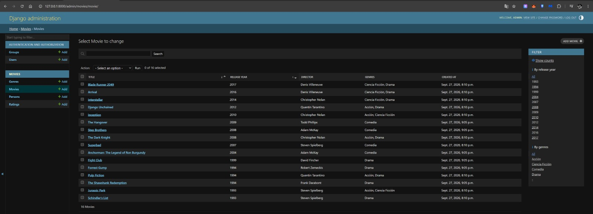
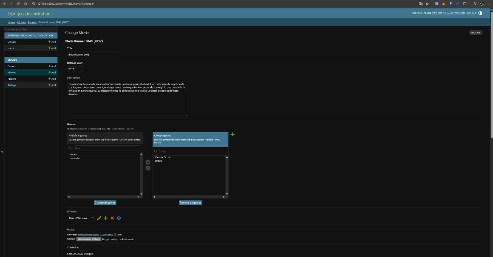
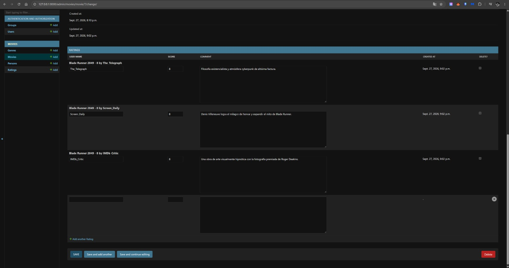
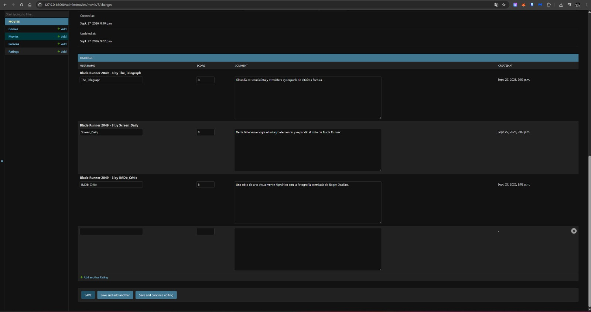
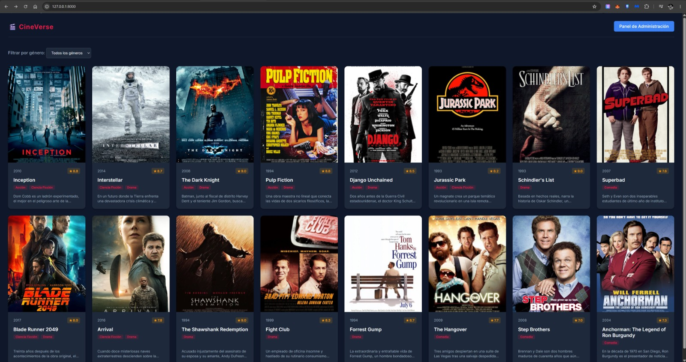
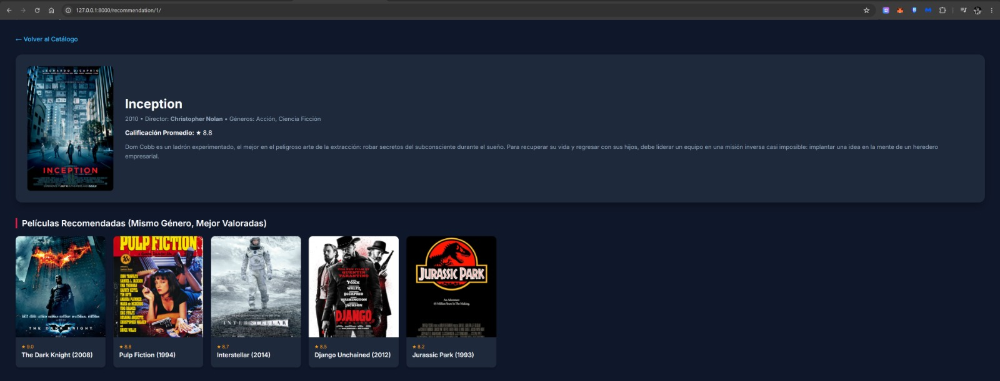

# Lab05: Sistema de Catálogo de Películas y Administración en Django

Este repositorio contiene el desarrollo del proyecto de Django para la gestión y administración avanzada de un catálogo de películas, cumpliendo rigurosamente con los estándares de arquitectura, personalización del panel de administración (`ModelAdmin`), control de acceso basado en roles (grupos y permisos) y vistas públicas con lógica de recomendación.

---

## 🚀 Descripción General del Proyecto

Este laboratorio implementa un sistema backend y frontend modular en **Django** para la administración profesional de películas, géneros, directores y valoraciones. El desarrollo abarca desde la configuración inicial y el uso de **Pillow** para imágenes hasta el modelado relacional avanzado, la personalización integral de Django Admin mediante clases `ModelAdmin` e `Inlines`, el establecimiento de campos de auditoría de solo lectura, la creación de roles de usuario restrictivos (grupo "editores") y la construcción de vistas públicas con algoritmos de recomendación basados en el ORM.

### 🔗 Enlaces de Acceso Local (Desarrollo)
Una vez ejecutado el servidor (`python manage.py runserver`), puedes acceder a:
- **Catálogo Principal (Frontend):** [http://127.0.0.1:8000/](http://127.0.0.1:8000/)
- **Panel de Administración (Django Admin):** [http://127.0.0.1:8000/admin/](http://127.0.0.1:8000/admin/) 
  - *Superusuario (Acceso Total):* `admin` / `admin123`
  - *Usuario Editor (Acceso Restringido):* `editor1` / `editor123`

---

## 📋 Resumen de Implementación (Paso a Paso)
1. **Estructura y Dependencias:** Creación del proyecto `config`, instalación de **Pillow** para el manejo de pósters y registro de la aplicación `movies` en `INSTALLED_APPS`.
2. **Modelos Relacionales:** Declaración de `Movie`, `Genre`, `Person` y `Rating` con nombres en singular, metadatos (`Meta`) y métodos de representación (`__str__`).
3. **Relaciones de Datos:** Vinculación de películas con géneros (Many-to-Many) y de valoraciones con películas (ForeignKey).
4. **Migraciones y Base de Datos:** Generación y aplicación de versiones de migraciones en SQLite.
5. **Registro Básico en Admin:** Validación inicial de las cuatro operaciones CRUD automáticas sin vistas previas.
6. **Personalización con `ModelAdmin`:** Definición de `list_display` con columnas útiles, `list_filter` por género y año, y `search_fields` por título y nombre del director.
7. **Inlines en Formularios:** Adición de `RatingInline` (TabularInline) para registrar valoraciones en bloque dentro del formulario padre de la película.
8. **Campos de Auditoría:** Restricción de los campos `created_at` y `updated_at` como `readonly_fields` de solo lectura.
9. **Datos de Prueba:** Población inicial de géneros, directores, 10+ películas, pósters oficiales e historiales de valoraciones.
10. **Control de Acceso (Grupos y Permisos):** Creación del grupo «editores» (con permisos para añadir y cambiar, pero sin derecho a eliminar registros) y un usuario de prueba asociado.
11. **Vista Pública de Recomendación:** Desarrollo de la vista web personalizada que calcula mediante agregaciones del ORM (`Avg`) las películas del mismo género mejor valoradas.

---

## 📐 Modelo Relacional y Esquema de Relaciones

El diseño de la base de datos se compone de los siguientes modelos y relaciones:

1. **`Genre` (Género)**
   - Representa las categorías temáticas de las películas.
   - Campos: `name`.

2. **`Person` (Persona / Director)**
   - Representa a los directores y creadores vinculados a las películas.
   - Campos: `first_name`, `last_name`, `birth_date`.

3. **`Movie` (Película)**
   - Entidad central conectada con:
     - **`Genre`**: Relación **`ManyToManyField`** (permite asociar múltiples géneros a una película).
     - **`Person`**: Relación **`ForeignKey`** con `on_delete=models.SET_NULL` (director).
     - **`Rating`**: Relación inversa mediante `related_name='ratings'`.
   - Campos: `title`, `release_year`, `description`, `poster`, `created_at`, `updated_at`.

4. **`Rating` (Valoración)**
   - Relacionada con `Movie` mediante un **`ForeignKey`** (`on_delete=models.CASCADE`).
   - Campos: `movie`, `user_name`, `score`, `comment`, `created_at`.

---

## 🔍 Observaciones y Decisiones de Diseño

1. **Uso de Singular en Modelos:**
   - Siguiendo las convenciones de Django y PEP 8, los nombres de las clases de los modelos están declinados en singular (`Movie`, `Genre`, `Person`, `Rating`), reflejando una única entidad por instancia.

2. **Idioma y Convenciones:**
   - Todo el código fuente, nombres de variables, métodos, campos y comentarios se han escrito rigurosamente en **inglés**. Los entregables, explicaciones y documentación se presentan en **español**.

3. **Personalización del Panel de Administración:**
   - Se sustituyó el registro predeterminado por clases `ModelAdmin` robustas que facilitan la búsqueda y filtrado de grandes volúmenes de datos cinematográficos.
   - La inclusión de `TabularInline` optimiza la experiencia del administrador al permitir gestionar las valoraciones sin abandonar la ficha de la película.
   - Los campos de auditoría (`created_at`, `updated_at`) se configuraron como de solo lectura para garantizar la integridad histórica de los registros.

4. **Control de Accesos y Roles:**
   - El uso de grupos y permisos nativos de Django demuestra cómo adaptar el panel a entornos de producción reales, restringiendo privilegios destructivos (como la eliminación de películas) a usuarios con rol de editores.

---

## 🤖 Agentes y Scripts de Automatización

Para asegurar una ejecución repetible y alineada con el procedimiento del curso, el proyecto incluye los siguientes scripts y agentes de automatización:

- **`setup_lab.py`**: Script maestro que inicializa la base de datos, crea el superusuario `admin`, los géneros, directores, 10 películas, valoraciones, y el grupo `editores` con sus permisos. Este script es la base del **Punto 1** (estructuración del proyecto) y el **Punto 8** (carga de datos de prueba).

- **`generate_posters.py`**: Agente que genera pósters cinematográficos profesionales mediante **Pillow** para las películas que no tenían imagen, guardándolos en `media/movies/posters/`. Cumple el requisito de tener Pillow instalado y imágenes asociadas.

- **`update_real_hollywood_data.py`**: Actualiza las descripciones y calificaciones de las películas usando datos realistas de Hollywood (calificaciones de críticos, sinopsis en español). Da realismo al Proyecto y cubre el **Punto 8** (datos de prueba con valoraciones).

- **`add_more_movies.py`**: Permite agregar 3 películas de drama y 3 de comedia al catálogo (Shawshank Redemption, Fight Club, Forrest Gump, The Hangover, Step Brothers, Anchorman). Extiende la base de datos inicial.

- **`fix_posters.py` / `download_posters_fix.py`**: Scripts de resolución de problemas para descargar o generar pósters oficiales de *Step Brothers* y *Anchorman* cuando las URLs externas fallan. Aseguran que todas las películas tengan imagen.

- **`download_real_posters.py`**: Intenta descargar pósters reales desde Wikimedia/TMDb/CDN usando `urllib` y cabeceras HTTP, como parte de la integración de **Pillow** y manejo de multimedia.

- **`translate_data.py`**: Actualiza los géneros (Acción, Comedia, Drama, Ciencia Ficción) y las descripciones de las películas al español directamente en la base de datos, alineándose con la norma de que los entregables y explicaciones están en español.

- **`setup_lab.py` (permisos editor)**: Script/acción que crea el grupo `editores` y el usuario `editor1`, aunque **nota importante**: originalmente no incluía `is_staff=True`, lo que explico a continuación.

---

## 📸 Evidencias y Capturas del Proyecto

### 1. Panel de Administración Personalizado (`ModelAdmin`)

### 2. Formulario de Película con Valoraciones en Línea (`Inlines`)

### 3. Campos de Auditoría de Solo Lectura

### 4. Panel de Administración con Usuario Editor (`editor1`)

### 5. Vista Pública - Catálogo General (`CineVerse`)

### 6. Vista Pública - Recomendaciones por Género

